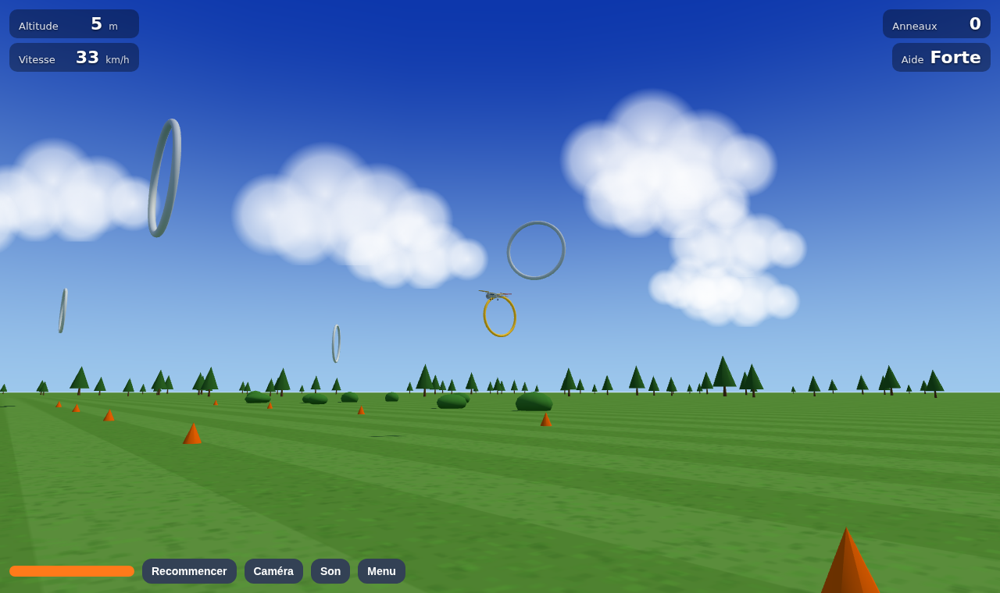

# Simulateur RC

Un simulateur de vol radiocommandé simple, dans le navigateur, pour apprendre à se servir
d'une radiocommande sans casser d'avion. Pensé pour un enfant : grand terrain dégagé,
avion docile, mode assisté qui remet l'avion à plat, anneaux à traverser, reprise
automatique après un crash.



## Démarrer

```sh
npm install
npm run dev
```

Ouvrir l'adresse affichée par Vite (en général `http://localhost:5173`) dans Chrome,
Edge ou Firefox. Pour une version prête à copier sur une clé ou à héberger :

```sh
npm run build      # produit le dossier dist/
npm run preview    # le sert en local
```

Les fichiers de `dist/` doivent être servis par un serveur web (pas ouverts en double-clic),
à cause des modules JavaScript. Le workflow `.github/workflows/deploy-pages.yml` publie
automatiquement sur GitHub Pages à chaque push sur `main`, une fois Pages activé dans
les réglages du dépôt (Settings → Pages → Source : GitHub Actions).

## Brancher la radio (Turnigy TGY-i6S, FlySky FS-i6S)

1. Brancher la radio au PC avec un câble micro-USB. Le mode « USB simulator » s'active
   seul : la radio apparaît comme une manette de jeu.
2. Sur la radio, créer un modèle « Simulateur » sans mixage, sans dual rate, trims au centre.
   Les trims de la radio s'appliquent aux axes USB.
3. Facultatif : dans les voies auxiliaires de la radio, affecter un interrupteur
   (par exemple SwA) à la voie 5. Il pourra servir de bouton « Recommencer ».
4. Dans le simulateur, bouger un manche pour que le navigateur montre la radio, puis
   cliquer sur **Régler la radio**. L'assistant demande de bouger chaque manche et
   détecte l'axe tout seul, puis le sens, puis la position de repos. Le réglage est
   mémorisé par le navigateur.

Les autres radios vues comme un joystick USB fonctionnent de la même façon : EdgeTX et
OpenTX en mode « USB Joystick (HID) », dongles simulateur, FlySky FS-SM100 sur une i6
sans USB, etc. Le site [gamepad-tester.com](https://gamepad-tester.com/) permet de vérifier
que le navigateur voit bien la radio.

Sans radio, le clavier prend le relais : flèches pour le manche de droite (flèche bas =
manche tiré = nez qui monte), **Z / S** pour les gaz, **Q / D** pour la dérive, **Espace**
pour recommencer, **F** pour la fumée, **C** pour changer de caméra, **P** pour la pause,
**Échap** pour le menu.

## Ce qu'il y a dedans

- **Trois avions** : un « Débutant 3 voies » (aile haute, grand dièdre, le manche de
  droite commande la dérive), un « Trainer 4 voies » avec ailerons, et un **Alphajet**
  à réacteur, rapide et vif, aux couleurs de la Patrouille de France.
- **Fumée de meeting** sur un interrupteur de la radio (ou la touche **F**). Dans la
  radio, affecter un interrupteur du haut (SwA, SwB…) à une voie auxiliaire, puis le
  déclarer à l'étape « Interrupteur de fumée » de l'assistant de réglage.
- **Vent** réglable : aucun, léger ou moyen, de face au décollage, avec des rafales.
- **Aide au pilotage** à trois niveaux. « Forte » est un mode angle : le manche commande
  une inclinaison, l'avion revient à plat quand on le lâche, l'inclinaison et l'assiette
  sont limitées. « Légère » ne fait que remettre à plat quand le manche est au centre.
  « Aucune » laisse l'avion se comporter comme un vrai.
- **Départ en l'air** (par défaut, pour apprendre à tourner tout de suite) ou **sur la
  piste** pour apprendre à décoller.
- **Parcours d'anneaux** en boucle devant le pilote, avec compteur.
- **Caméra pilote** au sol avec zoom automatique, comme sur un vrai terrain, ou caméra
  de poursuite.
- **Son** de moteur et signaux sonores, coupables d'un clic.

## Comment ça vole

La mécanique de vol est un modèle **par surfaces** : chaque demi-aile (deux panneaux par
côté), chaque demi-stabilisateur et la dérive sont des panneaux plans avec leur propre
vitesse locale, incidence, portance et traînée. Le dièdre, le virage à la dérive, le
décrochage et l'amortissement sortent naturellement du modèle, sans dérivées de stabilité
à régler. Les grandes lignes :

- Portance linéaire jusqu'au décrochage, puis transition progressive vers un comportement
  de plaque plane (modèle de Khan et Nahon 2015, comme dans Aircraft-Physics).
- Volets et gouvernes par décalage de l'incidence de portance nulle, efficacité selon la
  fraction de corde (théorie des profils minces). Ailes en flèche pour le jet.
- Déflexion de l'aile sur l'empennage (downwash), qui réduit l'efficacité du
  stabilisateur comme sur un vrai avion.
- Souffle d'hélice par la théorie de la quantité de mouvement, appliqué à l'empennage et
  aux panneaux intérieurs, plus couple de réaction et souffle hélicoïdal : à pleine
  puissance et basse vitesse l'avion tire à gauche, il faut corriger.
- Moteur avec montée en régime (rapide pour l'hélice, lente pour le réacteur), servos à
  vitesse finie, expo de 30 % sur les manches.
- Effet de sol près de la piste, vent avec gradient de hauteur et rafales, roue avant
  directrice au roulage.
- Corps rigide à six degrés de liberté, orientation en quaternion, intégration à pas fixe
  de 1/240 s.
- Contacts au sol par ressort-amortisseur sur les roues, les saumons et le fuselage, avec
  détection de crash tolérante.
- L'aide au pilotage inclut une protection contre le décrochage : sous la vitesse de
  sécurité, elle baisse le nez d'elle-même.

Le code du modèle est dans `src/core/` et ne dépend pas du navigateur : `aircraft.ts`
(géométrie des avions), `aero.ts` (forces d'un panneau), `sim.ts` (intégration et sol),
`assist.ts` (aide au pilotage). Les tests de `tests/` vérifient la stabilité statique,
le trim, un vol de 30 s, le plané, le roulage et le décollage de chaque avion.

```sh
npm test            # tests de physique
npm run typecheck   # TypeScript
npm run check       # tout, plus le build
```

## Organisation

```
src/core/    physique pure : avions, aérodynamique, simulation, aide au pilotage
src/input/   radio (API Gamepad), assistant de calibration, clavier
src/view/    scène Three.js : ciel, terrain, anneaux, maquette procédurale, caméras
src/app/     boucle de jeu, menus, HUD, sons
tests/       tests Vitest du cœur physique
docs/        études préalables : simulateurs existants, modèles de vol, modèles 3D
tools/       convertisseur AC3D vers OBJ pour les meshs CRRCsim et FlightGear
```

Les avions sont dessinés par le code à partir de leurs dimensions, il n'y a aucun modèle
3D externe ni aucune dépendance autre que Three.js. Pour ajouter un avion, décrire ses
panneaux dans `src/core/aircraft.ts` et l'ajouter à `AIRCRAFT_LIST`.

## Références

Les choix de conception s'appuient sur l'étude des projets libres documentée dans
`docs/references-sim-rc.md`, `docs/references-mecanique-de-vol.md` et
`docs/modeles-3d-avions.md`.
